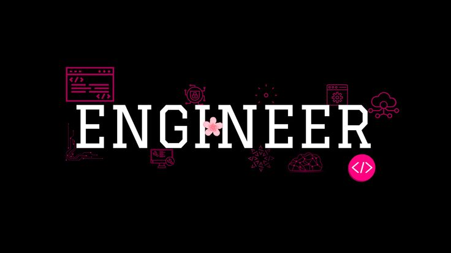

  <!-- Profile Views (Pink themed) -->
  
    
  <!-- Your Banner Image (from repo) -->
  
  
  

A Computer Engineering student learning backend engineering, focused on building scalable, reliable, and efficient systems using modern software practices. I'm currently strengthening my skills in APIs, databases, and system design while building personal projects.

  

  
  

  
 

  <h2>🛠️ Languages and Tools</h2>

   

  

    

  

  

I’m currently focusing on how the internet works at a foundational level, including:

<ul>
  <li>How the internet works end-to-end</li>
  <li>HTTP and how web communication works</li>
  <li>Domain names, DNS, and hosting</li>
  <li>How browsers work behind the scenes</li>
  <li>Version control systems (Git & GitHub)</li>
</ul>

After this, I’m moving into relational databases and how data is structured, stored, and queried efficiently.

